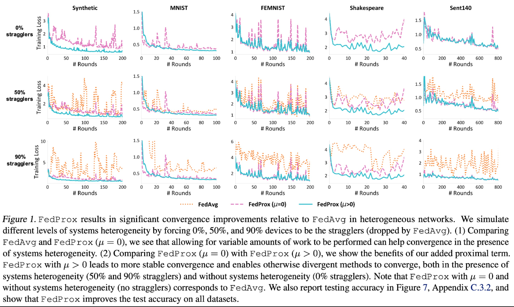

# Strategy: FedProx

## FedAvg v.s FedProx

| Heterogeneity        | FedAvg                                                                                                                                                            | FedProx                                                                                                                                                                                                             |
| -------------------- | ----------------------------------------------------------------------------------------------------------------------------------------------------------------- | ------------------------------------------------------------------------------------------------------------------------------------------------------------------------------------------------------------------- |
| data heterogeneity   | FedAvg does not guarantee fit for non-iid data                                                                                                                    | FedProx can guarantee the fitting rate for non-iid data: by changing the objective function of the overall optimization, based on an assumption of distribution difference, a convergence proof is obtained         |
| device heterogeneity | FedAvg does not take into account the heterogeneity of different devices, such as differences in computing power; for each device, the same workload is scheduled | FedProx supports local training for each device with different workloads: adjust the accuracy requirements for local training per device by setting a different "γ-inexact" parameter for each device in each round |

## Fit

Add Proximal Term to the objective function

$$
\mathop{max}\limits_{w} h_k(w;w^t)=F_k(w)+\frac{\mu}{2}||w-w^t||^2
$$

$F_k(w)$: For a set of parameters w, the loss obtained by training k local data on device k

$w^t$: The initial model parameters sent by the server to device k in the t-th round of training

$\mu$: a hyperparameter

$\mu/2||w - w^t||^2$: proximal term, which limits the difference between the optimized w and the $w^t$ released in the t round, so that the updated w of each device k is equal to Do not differ too much between them to help fit

## Different training requirements for each device: γ-inexact

FedAvg requires that each device is fully optimized for E epochs during training locally;
Due to equipment heterogeneity, FedProx hopes to put forward different optimization requirements for each equipment k in each round t, and does not require all equipment to be completely optimized;

$\mu_k^t \in [0,1]$, the higher the value, the looser the constraints, that is, the lower the training completion requirements for equipment k; on the contrary, when $\mu_k^t = 0$, the parameters are required the training update is 0, requiring the local model to fully fit;

With the help of $\mu_k^t$, the training volume per round of each device can be adjusted according to the computing resources of the device;

## Requirements for parameter selection in Convergence analysis

When the selected parameters meet the following conditions, the expected value of the convergence rate of the model can be bound

### Parameter conditions

$$
\rho^t=(\frac{1}{\mu}-\frac{\gamma^tB}{\mu}-\frac{B(1+\gamma^t\sqrt(2))}{ \overline\mu\sqrt(K)}-\frac{LB(1+\gamma^t)}{\overline\mu\mu} - \frac{L(1+\gamma^t)^2B^2} {2\mu^2}-\frac{LB^2(1+\gamma^t)^2}{\mu^2K}(2\sqrt{2K}+2))
$$

There are three groups of parameters to set: K, $\gamma$, $\mu$;
Where K is the number of client devices selected in the t round, $\gamma^t=max_k(\gamma_k^t)$, $\gamma$, $\mu$ is the hyperparameter for setting the proxy term. **B is a value used to assume the upper limit of the current participation data distribution difference, not sure how to get it**

### Fitting rate

Convergence can be proven if the parameters are set to meet the above requirements

### Sufficient and non-essential conditions for parameter selection

There is a tradeoff between $\gamma$ and $B$. For example, the larger $B$ is, the greater the difference in data distribution, the smaller the $\gamma$ must be, and the higher the training requirements for each device;

## Experiment 1: Effectiveness of proximal term and inexactness

## Summarize

The existence of $\gamma$ and $B$ is more theoretical, in practice, the workload of the device can be determined directly according to the device resources

## Implementation

1. The proxy term for data non-iid has been implemented;
2. The inexactness for device heterogeneity needs to be realized;

## Reference

[Federated Optimization in Heterogeneous Networks](https://arxiv.org/pdf/1812.06127.pdf)
