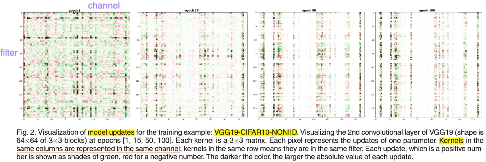
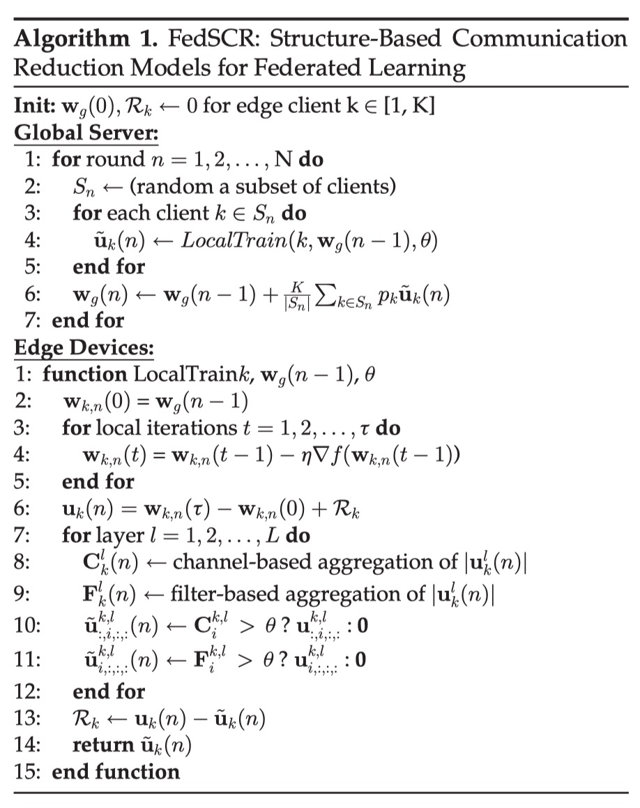
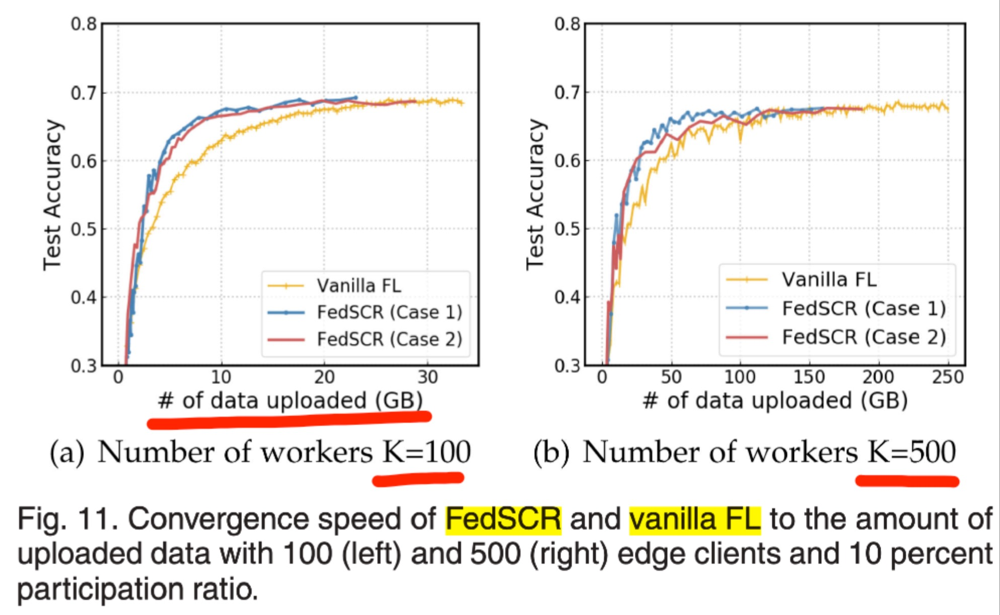
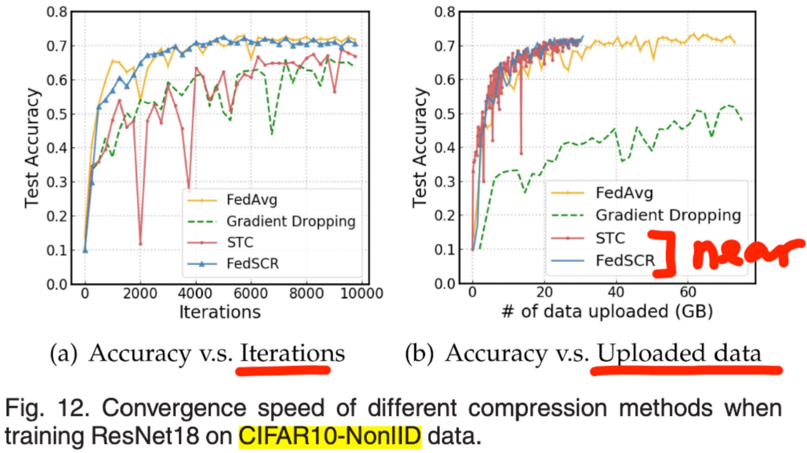
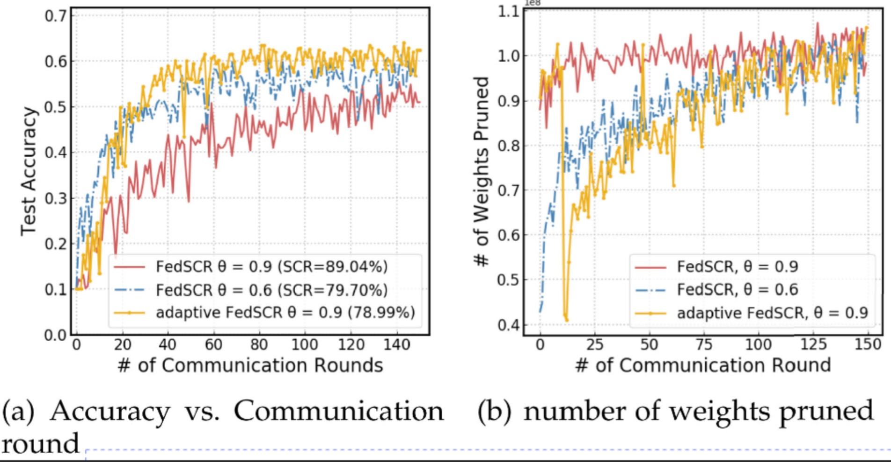
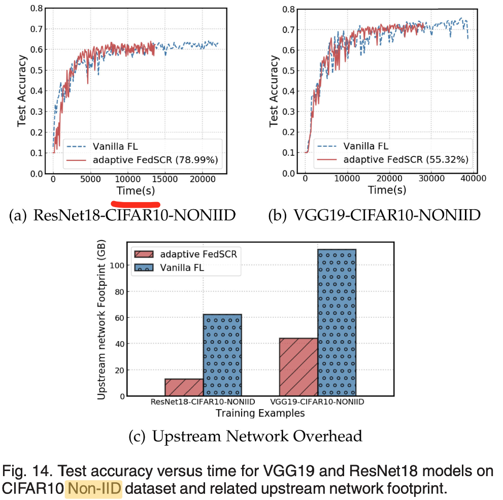

# Strategy: FedSCR

## Overview

|        | Sparse method        | Quant method             | Residual | Encoding         | Upstream | Downstream |
| ------ | -------------------- | ------------------------ | -------- | ---------------- | -------- | ---------- |
| FedSCR | structured threshold | None                     | Yes      | None             | Yes      | No         |
|        | Handle None-IID      | Handle Dropping/Skipping |          | Generality       |          |            |
|        | Adaptive threshold   | None                     |          | Only Conv-models |          |            |

The main motivation of FedSCR is to selectively send back some important updates. The main contributions are as follows:

1. Conduct empirical research on the pattern of parameter update in convolutional networks, and find that the parameter gradients "in the same filter" and "in the same channel" often have a strong correlation;
2. According to the conclusion in (1), some "unimportant" (absolute value and lower than threshold) filter or channel parameters will be selectively not transmitted in upstream as a method of sparsity;
3. The adaptive FedSCR is proposed for the non-iid situation, which can control each client to have a different threshold according to the heterogeneity;

## Empirical Research

It is observed that in the training process of the convolutional neural network, there is a strong correlation between the parameters corresponding to the same channel under the same filter:

The figure shows the visualization of the parameter gradient value of a fixed layer when epoch=1/15/50/100: where every three rows corresponds to a filter of the layer, and every three columns in a filter corresponds to a channel of the input of the layer, you can A large correlation between parameters in the same row/column is observed:

1. The update gradients of weights in the same filter/channel are very similar;
2. When a parameter is close to fitting, other parameters in the same filter/channel have a high probability of being close to fitting;

## Compression Design

### Sparsity Method（Core, structure-related）

The core idea is to filter out "unimportant parameters" by filter and channel when clients upload updates;
Filtering method: Add the absolute value of the gradient corresponding to each filter/channel. If the sum is less than the threshold, the update gradient corresponding to this filter/channel will not be uploaded in this round, but will be placed in the Residual;

### mathematical

Calculate the sum of the absolute values of gradients corresponding to a Channel:

$$
C^{k,l}_f(n)=\sum_{j=0}^{F_l}|u^{k,l}_{j,i,;,;}(n)|
$$

Calculate the sum of the absolute gradient values corresponding to a Filter:

$$
F^{k,l}_f(n)=\sum_{j=0}^{C*l}|u^{k,l}*{i,j,;,;}(n)|
$$

If C/F < threshold, set this channel/filter to 0;

### Pseudo Code (Compression)

## Adaptive FedSCR

In order to target the data distribution of non-iid, adaptive FedSCR is proposed. The purpose is to allow each client to adjust each client according to its own parameter updates (Weight Divergence, Significance of Local Updates) and global data distribution (Impact of Data Distribution). The threshold used by the client for sparseness

## Convergence Proof

reference:[Structure-Based Communication Reduction for Federated Learning](https://ieeexplore.ieee.org/document/9303442/figures#figures)

## Experiment

### on threshold

### on Convergence

### on Convergence (non-iid, compare with FedSTC)

### on accuracy

## Reference

[Structure-Based Communication Reduction for Federated Learning](https://ieeexplore.ieee.org/document/9303442/)
