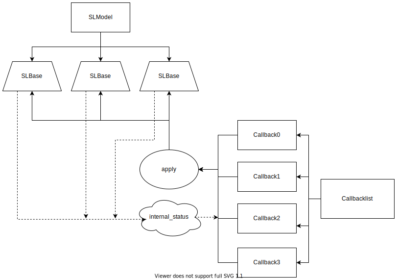

# 联邦框架Callback设计

## 背景

联邦框架SLModel和FLModel没有自己的callback模块，所有需要callback的能力只能借助后端的机器学习框架来做，但只有tensorflow有callback能力，torch是没有的，导致我们只有tensorflow后端才能使用callback能力，来做early stop，存证等等工作，在pytorch后端没有办法提供类似的能力。在一些场景用户需要在训练中自定义一些非训练逻辑，这时候提供一个联邦级别的callback能力可以满足用户的定制化需求。
在拆分学习中，模型是被分拆到多个阶段，所以依赖模型引擎的callback，只能附属于某一个阶段，没办法获得全局的callback能力。
联邦框架需要一个联邦全局的callback来管理所有的非训练逻辑，同时方便用户在联邦学习过程中来自定义其他行为。

## 目标

我们设计的联邦callback模块，目标是管理所有的非训练逻辑。将训练逻辑和非训练逻辑解耦的同时，提供灵活的callback接口，方便用户在不同的训练阶段嵌入其他的逻辑。比如日志，存证，earlystop等等。

- 模型保存
- 训练日志
- 防止过拟合
- 嵌入攻防逻辑
- 自定义其他的callback逻辑

## 设计

我们的联邦callback从大的来说分位两层，callbacklist和callbacks。callbacklist是slmodel来调用各个callback的handler。

我们联邦全局callback是一个driver层的概念，和slmodel是平级概念。方便从中心视角来组织统一的callback逻辑。
SLModel是整个训练流的逻辑中心，SLModel会持有一个`Callbacklist`的对象，作为从训练逻辑到旁路逻辑的入口。`Callbacklist`持有很多个逻辑埋点，每一个埋点对应`Callback`的相应埋点。例如`on_epoch_begin`,`on_epoch_end`, `on_agglayer_forward_begin`,`on_agglayer_forward_end`等。具体每个callback实现继承callback，然后根据需要重写某几个函数。
callback和slmodel共享了很多参数，最重要的是`Workers`，Callback拥有训练流中的`Workers`对象，所以callback不但可以处理很多中心端的控制逻辑，还可以控制训练的`Worker`来完成一些和模型绑定的行为，比如获取一些模型内部的状态，或者对某些状态进行修改。一些需要穿透到worker的local操作，也可以通过worker对象提供的`apply`函数来进行执行。这些逻辑会被注入到worker中，进行执行，但请注意，apply的逻辑不会提供任何返回。



### EarlyStopCallback

我们用一个例子来进一步了解下隐语联邦callback
`EarlyStopCallback`的主要逻辑是，在每一轮训练的特定位置捕获程序的状态，通过训练状态来判断训练是否需要停止，并返回一个指令给训练主逻辑，来提前退出训练。
那么在`SLModel`中的逻辑如下：

EarlyStop主要需要在两个埋点在做逻辑，一个是`on_epoch_end`在一次迭代之后检查是否满足退出要求，另一个是`on_test_end`更新评估指标。 EarlyStop的主要逻辑都在driver测，不需要操作worker的逻辑。
code：

```python
def on_epoch_end(self, epoch, logs=None):
    current = self.get_monitor_value(self.val_metrics)
    if current is None:
        return
    self.wait += 1
    if self._is_improvement(current, self.best):
        self.best = current
        # Only restart wait if we beat both the baseline and our previous best.
        if self.baseline is None or self._is_improvement(current, self.baseline):
            self.wait = 0
    if self.wait >= self.patience:
        self.stopped_epoch = epoch
        self.stop_training[0] = True

def on_train_begin(self, logs=None):
    self.wait = 0
    self.best = np.Inf if self.monitor_op == np.less else -np.Inf
    self.best_weights = None

def on_test_end(self, logs):
    self.val_metrics = reveal(logs)
```

#### 关于apply函数的用法

我们在sl_base的内部内置了`apply`函数，目的是能够让workers能够有能力执行callback中传入的local逻辑。比如，我们接下来在callback中定义一个`print_something`函数，然后在`on_train_end`阶段进行打印。

```python
def on_train_end(self, logs=None):
    def print_something():
        print("this logic will execute in worker)
    ######################################
    res = self._workers[alice].apply(print_something) #apply函数
    ######################################
    wait(res)
```

解释：这里定义了一个`print_something`，然后把这部分的逻辑通过`apply`函数交给了`alice`来进行执行。再具体调用的时候，`alice`就会正确的执行到这一段逻辑。
*`apply`的基本用法就是这样，传入一段逻辑，然后通过apply交给worker来进行执行*。
这段逻辑会在worker的内部执行，其结果不会离开worker本身。但是这段逻辑有可能会修改worker的内部。内部的状态可以通过`get_internal_status`来进行获取。
同时，apply也可用于worker状态的读写。我们接下来通过一个例子来看如何来调用内部的状态，进行读取和修改。

```python
# 注意：这里只是demo代码，里面的内容仅做用法演示！
def on_train_end(self, logs=None):
    def modify_learning_rate(worker,):
       worker.model_base.optimizer.learning_rate = 0.01

    res = self._workers[alice].apply(modify_learning_rate) #apply函数
```

这里有一个要点需要注意，可以观察到，`modify_learning_rate`函数是有一个参数`worker`,这个参数是什么呢？怎么理解怎么使用呢？

因为`modify_learning_rate`的函数中需要使用到worker对象本身的一些类属性进行读写修改，所以这里的`worker`起的就是一个placeholder的作用，在内部会被`self`进行替代。所以`worker.model_base`就可以直接理解为`sl_base.model_base`。

在这个例子中，我们把`worker`的`self`传给了`modify_learning_rate`，这时候`callback`中对于`worker`的操作，实际上就是对于`sl_base`的`self`对象的操作，self对象可以获取到内部的model，metric，parameter等,来做任何自定义的操作。

#### 2、如何在callback中调用worker来进行操作

我们定义的callback是和slmodel一个层级的逻辑，处于driver层。通过持有workers对象
在callback中有一个workers对象，他和slmodel里面的worker对象是一样的，调用的时候直接使用`self._workers[party_name]`即可。
比如需要获取worker当前的epoch信息。

```python
status = self._workers[self.device_y].get_internal_status()
epoch = status["epochs"]
```

## 埋点函数

我们预置了很多潜在的callback逻辑嵌入点，大家可以根据自己任务的需要进行使用。

```python
def on_train_begin(self, logs=None):
        pass

def on_train_end(self, logs=None):
    pass

def on_predict_begin(self, logs=None):
    pass

def on_predict_end(self, logs=None):
    pass

def on_test_begin(self, logs=None):
    pass

def on_test_end(self, logs=None):
    pass

def on_epoch_begin(self, epoch=None, logs=None):
    pass

def on_epoch_end(self, epoch=None, logs=None):
    pass

def on_batch_begin(self, batch):
    pass

def on_batch_end(self, batch):
    pass

def on_train_batch_begin(self, batch):
    pass

def on_train_batch_end(self, batch):
    pass

def on_test_batch_begin(self, batch):
    pass

def on_test_batch_end(self, batch):
    pass

def on_predict_batch_begin(self, batch):
    pass

def on_predict_batch_end(self, batch):
    pass

def on_agglayer_forward_begin(self, hiddens=None):
    pass

def on_agglayer_forward_end(self, hiddens=None):
    pass

def on_agglayer_backward_begin(self, gradients=None):
    pass

def on_agglayer_backward_end(self, gradients=None):
    pass

def on_base_forward_begin(self):
    pass

def on_base_forward_end(self):
    pass

def on_base_backward_begin(self):
    pass

def on_base_backward_end(self):
    pass

def on_fuse_forward_begin(self):
    pass

def on_fuse_backward_end(self):
    pass

```

## 小结

自定义callback需要注意以下几点：

1. callback的开发视角是driver视角，如果需要进入worker操作需要调用`self._worker[device_name]`来进行操作。
2. 需要从driver层传入到worker层工作的逻辑，可以使用`apply`方法来进行使用。
3. apply中定义的方法，可以通过placeholder来使用worker的内部属性。
4. 挑选合适的埋点函数进行重写，callback框架会在正确的时机进行调用。

## 总结

我们在联邦框架的基础上提供了联邦callback的框架，从一个大的多方全局视角提供了callback的能力。在callback层面统一了不同后端。提供callback框架后，我们可以将训练代码和非训练代码进行解耦，同时为用户在自定义需求的支持上提供了更方便直接的模式。
